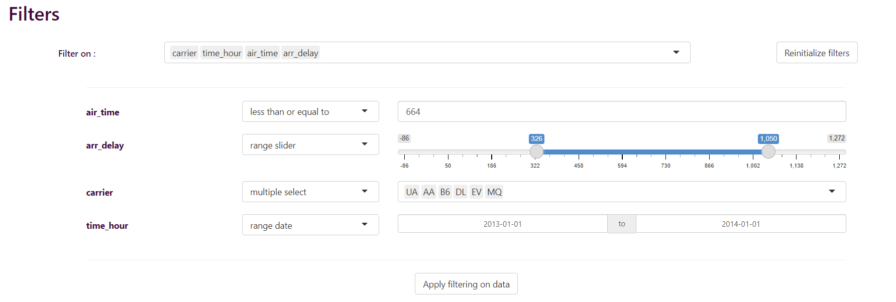
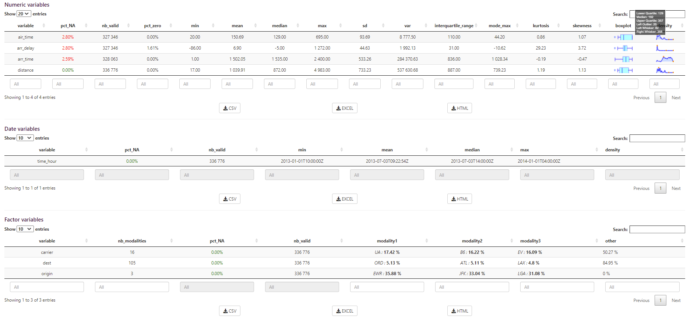
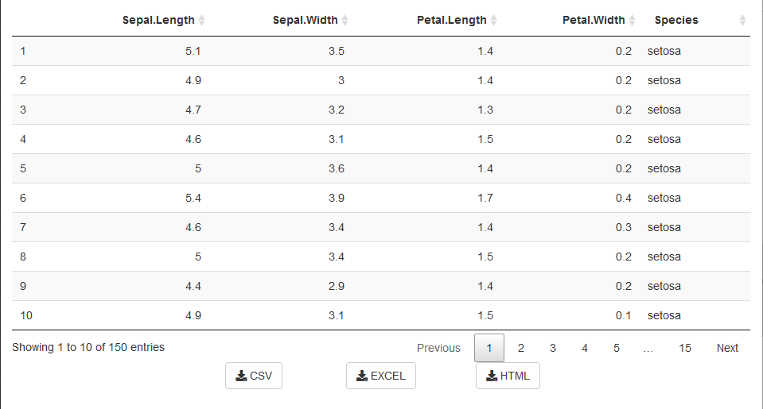
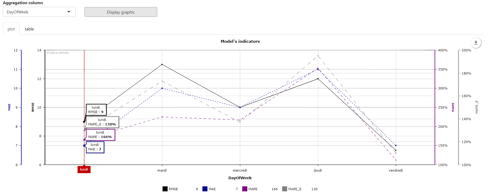
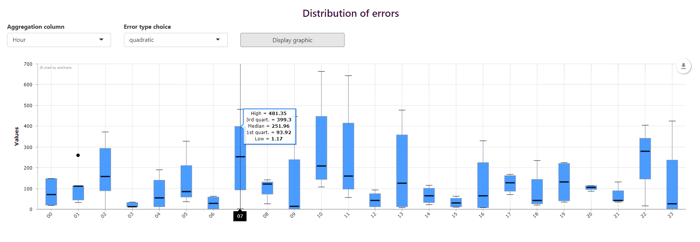

# shinymodules

This package provides some useful shiny modules to build quickly an ergonomic tool to explore a table.

### Installation

You can install:

-   the latest development version from GitHub with :

``` r
devtools::install_github("datastorm-open/shinymodules")
```

### Demo application

*online*

https://datastorm-demo.shinyapps.io/shinymodules/

*local*

``` r
if(!require(nycflights13)) install.packages("nycflights13")
if(!require(data.table)) install.packages("data.table")
if(!require(esquisse)) install.packages("esquisse")

runApp(system.file("demo_app", package = "shinymodules"))
```

## filter_data

``filter_data`` is a module used to filter a given data.table on chosen columns by the user. The server part returns a reactive value containing the filtered data.table.



```r
## UI
shinymodules::filter_data_UI(id = "filter_id",
			    labels = list(title = "Filtres",
					  no_data = "Pas de données disponibles",
					  filter = "Filter sur les colonnes",
					  reinitialize = "Réinitialisation des filtres",
					  validate = "Filtrer les données",
            complete_data = "Jeu de données total"))

## SERVER
input_filter <- reactive({...})
output_filter <- shiny::callModule(module = shinymodules::filter_data, 
				   id = "filter_id",
			           data = input_filter,
				   columns_to_filter = "all")
your_filtered_table <- output_filter$data
```

## summary_data

Display an automatically generate dashboard that shows descriptive statistics with `shinymodules::summary_data` : for every columns from the table you selected. The statistics chosen depend on the column's type (character, factor, numeric, date).



```r
## UI
shinymodules::summary_data_UI(id = "stat_desc_id", titles = FALSE)

## SERVER
input_show <- shiny::reactiveValues(data = NULL)
shiny::callModule(module = shinymodules::summary_data, 
		  data = shiny::reactive(input_show$data),
		  optional_stats = "all",
		  nb_modal2show = 6, 
	          labels = list(title = "Descriptive statistics",
				num_var = "Variables numériques",
				date_var = "Variables dates",
				factor_var = "Variables facteurs",
				message = "Calcul des indicateurs en cours..."))
```

## show_DT

Show & export table using **DT** package



```r
## UI
shinymodules::show_DT_UI("iris_module")

## SERVER
shiny::callModule(show_DT, "iris_module", reactive(iris), reactive(DT::datatable(iris)), 
   paste0("Iris_export", format(Sys.time(), format = "...")))
```


## monitoring_data

This module provides tools to monitor models. (Only quantitative regression at moment)






```r
## UI
shinymodules::monitoring_data_UI("my_id")

## SERVER
shiny::callModule(shinymodules::monitoring_data, "my_id", data = reactive(data), 
                  col_obs = col_obs,
                  col_fit = col_fit,
                  col_date = col_date,
                  indicators = indicators)
```
