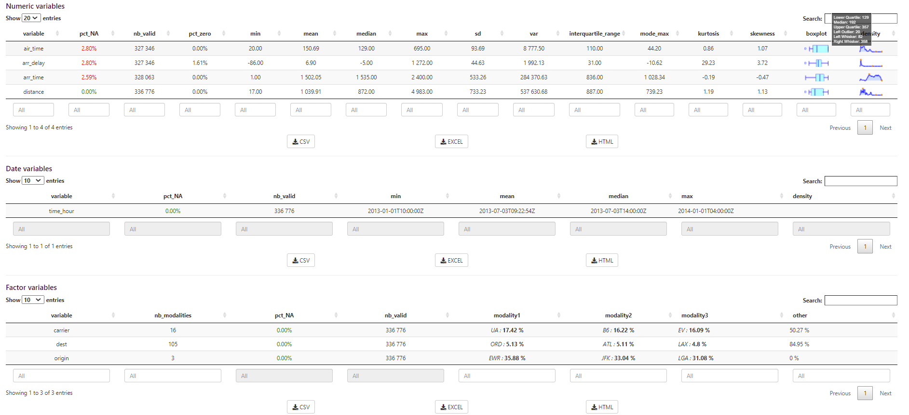
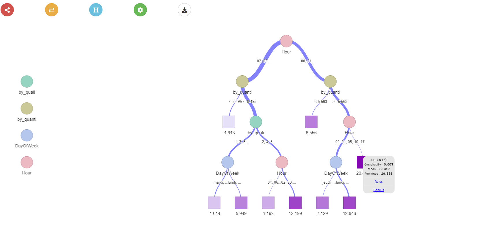

# shinymodules

On continue notre série sur les packages **shiny** chez **Datastorm** avec aujourd'hui **shinymodules**, dans lequel on va retrouver 4 modules permettant d'explorer rapidement nos données.

C'est un package qui peut paraître certes un peu *fourre-tout*, car il résulte de la nécessité de mutualiser les différents développements réalisés au-sein des nos projets chez Datastorm afin de ne pas *réinventer la roue* en permanence, mais dans lequel on retrouve néanmoins des fonctionnalités très utiles que nous utilisons au quotidien pour nos applications développeés pour les équipes *métier* de nos clients.

### Installation

Le package ne sera donc à priori pas mis sur le **CRAN** dans sa structure actuelle. En revanche, vous pouvez l'installer directement depuis notre github https://github.com/datastorm-open : 

``` r
if(!require(devtools)) install.packages("devtools")
devtools::install_github("datastorm-open/shinymodules")
```

Et bien évidemment, le code source est accessible à la même adresse.


### Application de démonstration

Une application de démonstration est disponible 

- directement dans le package : 

``` r
if(!require(nycflights13)) install.packages("nycflights13")
if(!require(data.table)) install.packages("data.table")
if(!require(esquisse)) install.packages("esquisse")
if(!require(colourpicker)) install.packages("colourpicker")

shiny::runApp(system.file("demo_app", package = "shinymodules"))
```

- et en ligne à l'adresse suivante : https://datastorm-demo.shinyapps.io/shinymodules/


### Fonctionnalités

#### 1. Filtrer les données

Le premier module ``filter_data`` permet de filtrer dynamiquement les données. Branché à une table, l'utilisateur pourra alors définir la sous-table qu'il souhaite ensuite analyser. Avec des possibilités de filtres multiples et fonction du type des colonnes sélectionnées : 

- Valeur unique, plages définies en fonction de seuils ou avec des bornes pour les variables quantitatives
- Choix simple ou multiple pour les variables qualitatives
- Jour ou période pour les variables de dates


```r
?shinymodules::filter_data
# ui.R
shinymodules::filter_data_UI(id = "filter_id"))

# server.R
full_data <- shiny::reactive({my_data})
output_filter <- shiny::callModule(module = shinymodules::filter_data, 
          id = "filter_id",
          data = full_data,
          columns_to_filter = "all")

# then, hafe fun with filter data !
your_filtered_table <- output_filter$data
```

#### 2. Résumer les données

Une fois notre jeu de données défini, on souhaite avoir une vue synthétique de nos variables. C'est ce que propose ``summary_data`` avec le calcul et l'affichage d'un ensemble de statistiques descriptives (données manquantes & distributions).




```r
?shinymodules::summary_data
# ui.R
shinymodules::summary_data_UI(id = "stat_desc_id", titles = FALSE)

# server.R
data <- shiny::reactive({my_data})
shiny::callModule(module = shinymodules::summary_data, 
		  data = shiny::reactive(data))
```

Les indicateurs affichés sont paramétrables et les tableaux sont téléchargeables sous différents formats (*.csv*, *.xlsx* ou *.html*), ce qui nous amène  au 3ième module disponible.

#### 3. Télécharger les données

Le 3ième module ``show_DT`` permet quand à lui simplement d'afficher une table avec le package **DT** en proposant à l'utilisateur de la télécharger. Il est donc relativement *basique* mais néanmoins très utile !


```r
?shinymodules::show_DT
# ui.R
shinymodules::show_DT_UI(
     id = "iris_module", 
     export = c("csv", "html")
)

# server.R
shiny::callModule(module = show_DT, 
    id = "iris_module", 
    data = reactive(iris), 
    dt = reactive(DT::datatable(iris)), 
    file_name = paste0("Iris_export", format(Sys.time(), format = "%d%m%Y_%H%M%S"))
)
```

#### 4. Analyser les performances d'un modèle de régression / Monitorer

Pour terminer, le dernier module propose un ensemble de fonctionnalités pour analyser les performances d'un modèle de régression.

Dans le cas de données temporelles, des variables complémentaires sont automatiquement créées (heure, jour de la semaine, ...)

- Calcul d'indicateurs de performance (*RMSE*, *MAE*, *MAPE*) au global ou sur des sous-populations définies par une variable sélectionnée


- Distributions des erreurs (relatives, absolues ou quadratiques)


- Arbres de régression avec le package **visNetwork**



```r
?shinymodules::monitoring_data
# ui.R
shinymodules::monitoring_data_UI(
     id = "monitoring", 
)

# server.R
shiny::callModule(module = monitoring_data, id = "my_id", 
             data = reactive(data),
             col_obs = col_obs,
             col_fit = col_fit,
             col_date = col_date,
             indicators = indicators
)
```